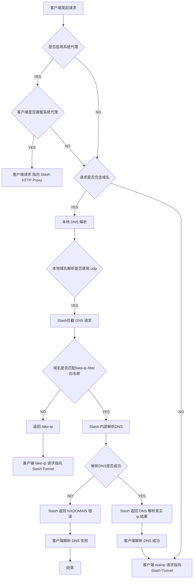

# 网络请求分流走向

- 系统代理模式
- Tunnel 模式

## 客户端请求流程

```mermaid
flowchart TB
    C1[客户端解析 DNS 失败]
    C2[客户端解析 DNS 成功]
    C3[客户端 real-ip 请求指向Stash Tunnel]
    C4[客户端请求 指向 Stash HTTP Proxy]
    C5[客户端 fake-ip 请求指向 Stash Tunnel]
    END[结束]

    A[客户端发起请求] --> A1{是否启用系统代理}
        A1 -->|YES| A1.1{客户端是否遵循系统代理}
            A1.1 --> |NO| A3
            A1.1 --> |YES| C4
        A1 -->|NO| A3{请求是否包含域名}
            A3 -->|YES| A4[本地 DNS 解析]
            A4 --> A4.1{本地域名解析是否使用 udp}
                A4.1 --> |YES| A4.2[Stash拦截 DNS 请求]
                    A4.2 --> A4.3{域名是否匹配fake-ip-filter 白名单}
                        A4.3 -->|YES| A4.4[Stash 内部解析DNS]
                        A4.4 --> A4.5{解析DNS是否成功}
                            A4.5 -->|NO| A4.6[Stash 返回 NXDOMAIN 错误]
                            A4.6 --> C1
                            C1 --> END

                            A4.5 -->|YES| A4.7[Stash 返回 DNS 解析真实 ip 结果]
                            A4.7 --> C2
                            C2 --> C3
                        
                        A4.3 --> |NO| A4.8[返回 fake-ip]
                        A4.8 --> C5
                    A3 -->|NO| C3


```

## Stash 内部 DNS 解析流程

## Stash HTTP Proxy 处理请求

## Stash Tunnel 处理 IP 请求
