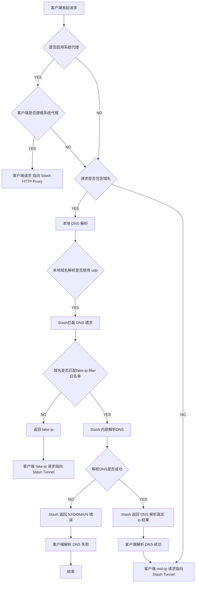
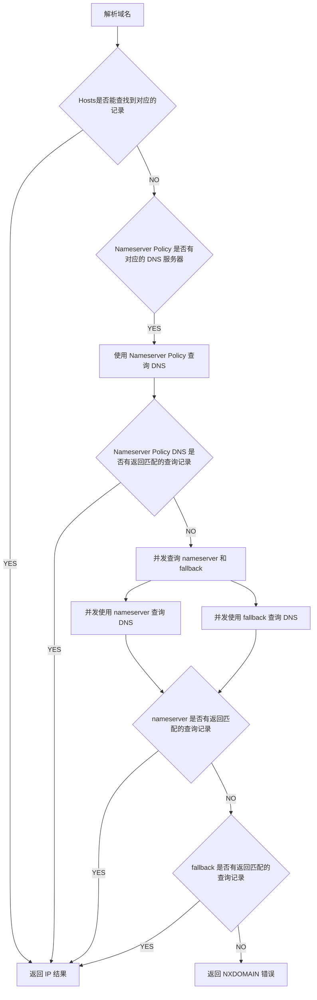

# 网络请求分流走向

- 系统代理模式
- Tunnel 模式

## 客户端请求流程

- 开启系统代理模式下，客户端如果遵循系统代理，则不需要进行 dns 解析，而且直接将请求交给HTTP 代理服务器进行处理

- 若客户端不遵循系统代理或者没有启用系统代理, 则客户端会考虑使用系统默认 DNS 或内置的 DNS服务器进行查询.
    - 如果系统 DNS 或者客户都内置 DNS 使用 udp 查询，网关模式下，Stash Tunnel 会拦截并返回Stash 内部的 DNS 查询结果
    - 如果系统 DNS 或者客户都内置 DNS 使用 doh 或 dot 加密请求, 默认情况下 Stash Tunnel 不会拦截

查看流程图

## Stash 内部 DNS 解析流程

此流程为按照使用推测, 非明确的官方流程

按以下优先级返回IP, 若无 IP 则返回 NXDOMAIN

1. Hosts
2. Nameserver Policy
3. Nameserver
4. Fallback
5. NXDOMAIN

查看流程图

## Stash HTTP Proxy 处理请求

## Stash Tunnel 处理 IP 请求
