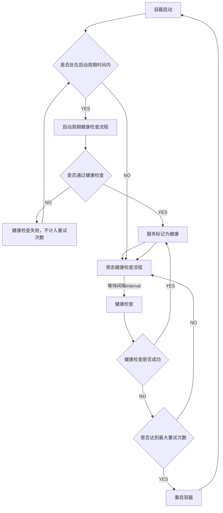

# Docker Compose

- <https://docs.docker.com/reference/compose-file/services/>

## 健康检查

- <https://docs.docker.com/reference/compose-file/services/#healthcheck>
- <https://docs.docker.com/reference/dockerfile/#healthcheck>

<details>

<summary>查看流程图示例</summary>

</details>

<details>

<summary>查看配置示例</summary>

```yaml
healthcheck:
  test: ["CMD", "curl", "-f", "http://localhost"]
  interval: 1m30s
  timeout: 10s
  retries: 3
  start_period: 40s
  start_interval: 5s
```

</details>

## 资源限制

- <https://docs.docker.com/reference/compose-file/deploy/#resources>

<details>

<summary>查看配置示例</summary>

```yaml
services:
  frontend:
    image: example/webapp
    deploy:
      resources:
        limits:
          cpus: '0.50'
          memory: 50M
          pids: 100
        reservations:
          cpus: '0.25'
          memory: 20M
```

</details>
