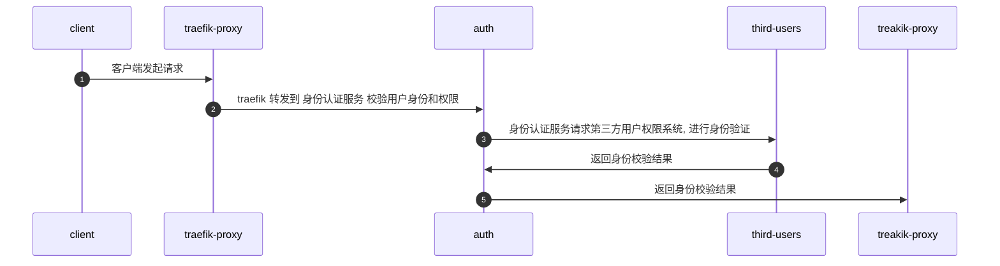

# tmp

```mermaid title="sequenceDiagram"
sequenceDiagram
autonumber
client ->> traefik-proxy: 客户端发起请求
traefik-proxy ->> auth: traefik 转发到 身份认证服务 校验用户身份和权限
auth ->> third-users: 身份认证服务请求第三方用户权限系统, 进行身份验证
third-users->>auth:返回身份校验结果
auth ->> treakik-proxy:返回身份校验结果
```
