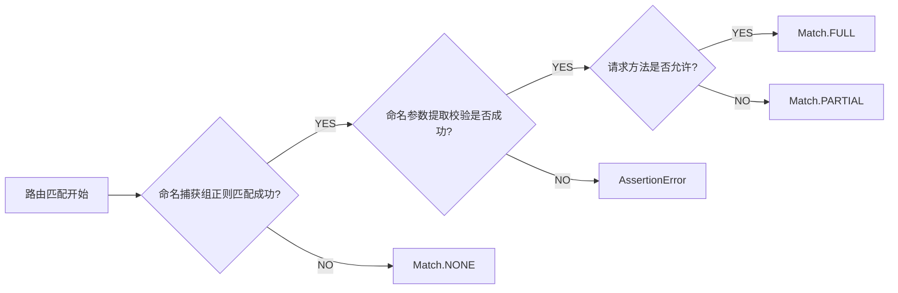

# 路由函数

## 路由实现

### 基本流程

路由函数在`fastapi.routing.APIRouter.add_api_route`注册的时候，会经由 `fastapi.routing.APIRoute` 实例化的时候编译路径, 以便后续匹配

`get_route_handler` 基于闭包返回了处理请求和返回响应的处理函数。

在`get_route_handler`中提取了请求参数，并将请求传递到`solve_dependencies`, 处理依赖注入。

最终使用 `run_endpoint_function` 运行用户函数传入请求和依赖, 返回响应结果

`starlette.routing.request_response` 包装路由函数, 实现 ASGIApp 协议的调用机制

最终，通过中间件的 ASGI 调用链, ASGIApp 被传递到`fastapi.routing.APIRoute.app` 执行用户代码

1. `fastapi.routing.APIRouter.add_api_route`
      1. `fastapi.routing.APIRoute.__init__`
         1. `starlette.routing.compile_path`
         2. `starlette.routing.request_response`
            1. `fastapi.routing.APIRoute.get_route_handler`
         3. `fastapi.routing.APIRoute.app`

### 注册/编译

`starlette.routing.compile_path` 实现路由编译, 并返回编译后的三元组

#### 路径参数匹配

通过正则匹配类似`{id:int}`的字符串，获取路径参数, 提取参数名称和类型

<details>

<summary>查看代码示例</summary>

```python
PARAM_REGEX = re.compile("{([a-zA-Z_][a-zA-Z0-9_]*)(:[a-zA-Z_][a-zA-Z0-9_]*)?}")
for match in PARAM_REGEX.finditer(path):
    param_name, convertor_type = match.groups("str")
    convertor_type = convertor_type.lstrip(":")
    assert convertor_type in CONVERTOR_TYPES, (
        f"Unknown path convertor '{convertor_type}'"
    )
    convertor = CONVERTOR_TYPES[convertor_type]

    path_regex += re.escape(path[idx : match.start()])
    path_regex += f"(?P<{param_name}>{convertor.regex})"

    path_format += path[idx : match.start()]
    path_format += "{%s}" % param_name
    if param_name in param_convertors:
        duplicated_params.add(param_name)

    param_convertors[param_name] = convertor

    idx = match.end()    
```

</details>

#### 路径参数类型转换

成功匹配到类似`{username:str}`的路径参数表达式后, 生成命名捕获组并分配一个`Convertor`, 其中`Convertor` 包含一个对应参数类型的正则表达式以及转换处理函数

<details>

<summary>查看代码示例</summary>

```python
T = TypeVar("T")


class Convertor(Generic[T]):
    regex: ClassVar[str] = ""

    def convert(self, value: str) -> T:
        raise NotImplementedError()  # pragma: no cover

    def to_string(self, value: T) -> str:
        raise NotImplementedError()  # pragma: no cover


class StringConvertor(Convertor[str]):
    regex = "[^/]+"

    def convert(self, value: str) -> str:
        return value

    def to_string(self, value: str) -> str:
        value = str(value)
        assert "/" not in value, "May not contain path separators"
        assert value, "Must not be empty"
        return value

class IntegerConvertor(Convertor[int]):
    regex = "[0-9]+"

    def convert(self, value: str) -> int:
        return int(value)

    def to_string(self, value: int) -> str:
        value = int(value)
        assert value >= 0, "Negative integers are not supported"
        return str(value)        
```

</details>

#### 编译存储

路由参数编译后返回三元组，用于后续匹配规则

- `path_regex` 是对路径字符处理后的命名捕获组
- `format` 是移除路径参数中参数类型后的字符串
- `convertors` 是对命名捕获后的遍历进行有效值验证和类型转换的转换器

<details>

<summary>查看代码示例</summary>

```python
self.path_regex, self.path_format, self.param_convertors = compile_path(path)

def compile_path(
    path: str,
) -> typing.Tuple[typing.Pattern, str, typing.Dict[str, Convertor]]:
    """
    Given a path string, like: "/{username:str}", return a three-tuple
    of (regex, format, {param_name:convertor}).

    regex:      "/(?P<username>[^/]+)"
    format:     "/{username}"
    convertors: {"username": StringConvertor()}
    """
```

</details>

### 匹配

1. 首轮匹配
2. 次轮匹配
3. 匹配失败

#### 首轮匹配

`starlette.routing.Router.app` 内触发路由匹配，根据匹配结果分为 `FULL`和`PARTIAL`

对于第一个全匹配的路由，则直接进入处理流程

遍历完路由后，如果没有全匹配的路由，则进入对一个部分匹配的路由函数

<details>

<summary>查看代码</summary>

```python
for route in self.routes:
    # Determine if any route matches the incoming scope,
    # and hand over to the matching route if found.
    match, child_scope = route.matches(scope)
    if match == Match.FULL:
        scope.update(child_scope)
        await route.handle(scope, receive, send)
        return
    elif match == Match.PARTIAL and partial is None:
        partial = route
        partial_scope = child_scope
```

</details>

#### 次轮匹配

如果在首轮遍历未能找到全匹配或部分匹配的路由函数, 则会根据设置，添加或移除尾斜杠`/`再进行第二轮匹配

次轮匹配对于第一个有效的匹配结果, 无论是完全匹配还是部分匹配, 都会以此返回重定向响应结果

<details>

<summary>查看代码</summary>

```python
route_path = get_route_path(scope)
if scope["type"] == "http" and self.redirect_slashes and route_path != "/":
    redirect_scope = dict(scope)
    if route_path.endswith("/"):
        redirect_scope["path"] = redirect_scope["path"].rstrip("/")
    else:
        redirect_scope["path"] = redirect_scope["path"] + "/"

    for route in self.routes:
        match, child_scope = route.matches(redirect_scope)
        if match != Match.NONE:
            redirect_url = URL(scope=redirect_scope)
            response = RedirectResponse(url=str(redirect_url))
            await response(scope, receive, send)
            return

await self.default(scope, receive, send)
```

</details>

#### 匹配规则

匹配的具体行为由 `starlette.routing.Route.matches` 进行

根据编译时存储的命名捕获组, 对请求路径进行正则匹配和参数提取校验.

如果没有成功的正则匹配，则返回匹配失败。

如果参数校验通过，且当前请求的方法在路由函数的注册方法内，则认为完全匹配。

如果方法未注册，则返回部分匹配。



<details>

<summary>查看代码</summary>

```python
def matches(self, scope: Scope) -> tuple[Match, Scope]:
    path_params: dict[str, Any]
    if scope["type"] == "http":
        route_path = get_route_path(scope)
        match = self.path_regex.match(route_path)
        if match:
            matched_params = match.groupdict()
            for key, value in matched_params.items():
                matched_params[key] = self.param_convertors[key].convert(value)
            path_params = dict(scope.get("path_params", {}))
            path_params.update(matched_params)
            child_scope = {"endpoint": self.endpoint, "path_params": path_params}
            if self.methods and scope["method"] not in self.methods:
                return Match.PARTIAL, child_scope
            else:
                return Match.FULL, child_scope
    return Match.NONE, {}
```

</details>

#### 匹配失败

对于两轮匹配失败后，进入`not_found`

返回 404

<details>

<summary>查看代码</summary>

```python
async def not_found(self, scope: Scope, receive: Receive, send: Send) -> None:
    if scope["type"] == "websocket":
        websocket_close = WebSocketClose()
        await websocket_close(scope, receive, send)
        return

    # If we're running inside a starlette application then raise an
    # exception, so that the configurable exception handler can deal with
    # returning the response. For plain ASGI apps, just return the response.
    if "app" in scope:
        raise HTTPException(status_code=404)
    else:
        response = PlainTextResponse("Not Found", status_code=404)
    await response(scope, receive, send)
```

</details>

### 路由函数预处理

#### 完全匹配与部分匹配的区别

在路由匹配规则里，根据路由函数是否允许当前请求的方法，分为 `Match.FULL` 和 `Match.PARTIAL`

实际上，这两种情况在处理上没有实际的区别。

`Match.PARTIAL` 是 `Match.FULL` 没有成功的一种回退，最终都会在`Route.handle` 里对方法再次判断，返回 405 响应

<details>

<summary>查看代码</summary>

```python
# starlette.routing.Router.app
for route in self.routes:
    # Determine if any route matches the incoming scope,
    # and hand over to the matching route if found.
    match, child_scope = route.matches(scope)
    if match == Match.FULL:
        scope.update(child_scope)
        await route.handle(scope, receive, send)
        return
    elif match == Match.PARTIAL and partial is None:
        partial = route
        partial_scope = child_scope

if partial is not None:
    #  Handle partial matches. These are cases where an endpoint is
    # able to handle the request, but is not a preferred option.
    # We use this in particular to deal with "405 Method Not Allowed".
    scope.update(partial_scope)
    await partial.handle(scope, receive, send)
    return
```

```python
# starlette.routing.Route.handle
async def handle(self, scope: Scope, receive: Receive, send: Send) -> None:
    if self.methods and scope["method"] not in self.methods:
        headers = {"Allow": ", ".join(self.methods)}
        if "app" in scope:
            raise HTTPException(status_code=405, headers=headers)
        else:
            response = PlainTextResponse(
                "Method Not Allowed", status_code=405, headers=headers
            )
        await response(scope, receive, send)
    else:
        await self.app(scope, receive, send)
```

</details>

## 函数注释

让函数文档注释的一部分出现在 openapi 的文档说明中，而不是全部。

### FastAPI 是如何从函数注释中提取文档部分的

`fastapi.openapi.utils.get_openapi_path` 读取了每个路由函数对应 openapi 的参数

从`fastapi.openapi.utils.get_openapi_operation_metadata`可知，API 的 `description` 对应 APIRoute.description。

而从`fastapi.routing.APIRoute` 源码可知， `OpenAPI` 默认会使用函数的`__doc__`的第一个`\f`字符的前缀部分, 并且使用了 `inspect.cleandoc` 格式化文档

<details>
<summary>查看完整代码</summary>

get_openapi_path

```python
operation = get_openapi_operation_metadata(
    route=route, method=method, operation_ids=operation_ids
)
```

get_openapi_operation_metadata

```python
def get_openapi_operation_metadata(
    *, route: routing.APIRoute, method: str, operation_ids: Set[str]
) -> Dict[str, Any]:
    operation: Dict[str, Any] = {}
    if route.tags:
        operation["tags"] = route.tags
    operation["summary"] = generate_operation_summary(route=route, method=method)
    if route.description:
        operation["description"] = route.description
    operation_id = route.operation_id or route.unique_id
    if operation_id in operation_ids:
        message = (
            f"Duplicate Operation ID {operation_id} for function "
            + f"{route.endpoint.__name__}"
        )
        file_name = getattr(route.endpoint, "__globals__", {}).get("__file__")
        if file_name:
            message += f" at {file_name}"
        warnings.warn(message, stacklevel=1)
    operation_ids.add(operation_id)
    operation["operationId"] = operation_id
    if route.deprecated:
        operation["deprecated"] = route.deprecated
    return operation
```

fastapi.routing.APIRoute.__init__

```python
self.description = description or inspect.cleandoc(self.endpoint.__doc__ or "")
# if a "form feed" character (page break) is found in the description text,
# truncate description text to the content preceding the first "form feed"
self.description = self.description.split("\f")[0].strip()
```

</details>

### 函数注释的正确姿势

```python
import uvicorn
from fastapi import FastAPI


app = FastAPI()


@app.get("/v1")
def v1():
    """应该出现在OpenAPI 内

    \f不应该出现在 OpenAPI 内
    """
    return ""

if __name__ == "__main__":
    uvicorn.run("main:app", host="0.0.0.0", port=8000, reload=True)

```

如代码所示，其中 v1 在文档中会看见不符合预期的内容

### 函数注释分段失效的原因

```python
import inspect


def v1():
    """应该出现在OpenAPI 内

    \f不应该出现在 OpenAPI 内
    """
    return ""


doc = v1.__doc__
assert doc
assert "\f" in doc
assert "\f" not in inspect.cleandoc(doc)
```

如上图所示参数代码, `inspect.cleandoc` 会导致行首的`\f`被清除

所以处理方式应该修改如下

```python
self.description = description or inspect.cleandoc(self.endpoint.__doc__.split("\f")[0]).strip() if self.endpoint.__doc__ else "" 
```

## 回顾

1. 路由根据添加顺序存储在列表，匹配时在第一个全匹配路由函数停止，否则会遍历.
2. 路由在添加时会被编译成命名捕获组进行存储, 在匹配时基于命名捕获组提取变量，并基于编译存储的转换器验证和转换值和类型
