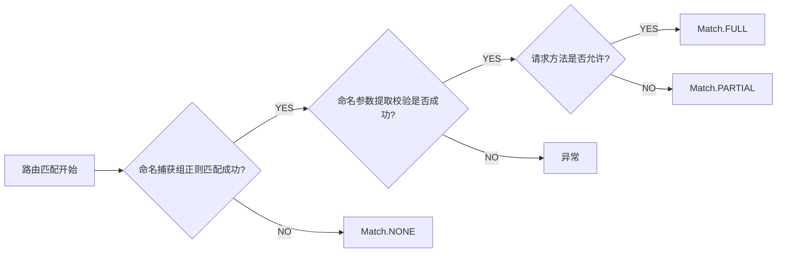
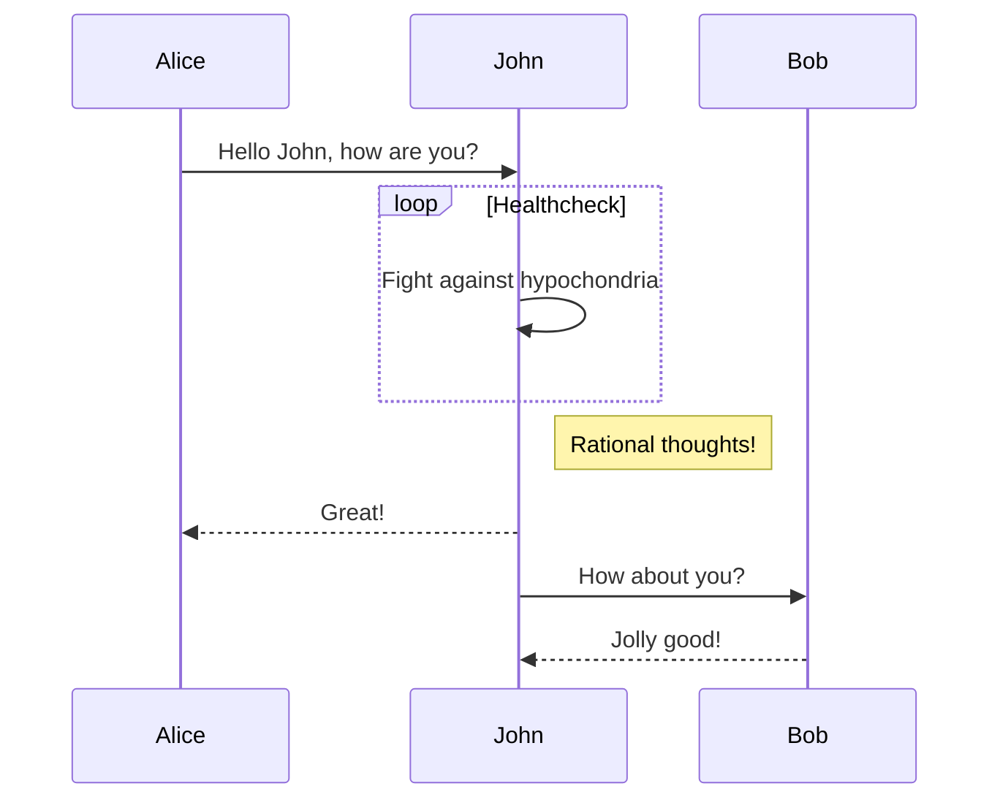
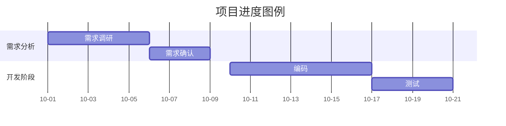

# [mermaid](https://github.com/mermaid-js/mermaid)

[mkdocs-material-diagrams](https://squidfunk.github.io/mkdocs-material/reference/diagrams/)

## 流程图



```` markdown title="sequenceDiagram"

````


## 甘特图


